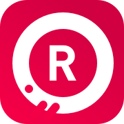

<p align="center">
  
</p>

<p align="center">
  Native iOS App for Awesome Retros!
</p>

<p align="center">
  
</p>

## Table of Contents

- [Introduction](#introduction)
- [Features](#features)
- [Feedback](#feedback)


## Introduction

[](http://makeapullrequest.com)

Welcome! This handy app aims to make your retros more efficient and fun. Users can add new items along with their sentiment (positive, meh, negative) and can upvote other items that they sympathize with. The app was built in Swift and Firebase's Realtime Database.

This app was created during my time as a student at Code Chrysalis. It was built in a 2-day sprint in which we pick up a new language and build something with it.

## Features

Current Features:

* See a list of items your team added, sorted by sentiment
* Add a new item along with your sentiment (positive, meh, negative)
* Conditional color-coding based on sentiments
* Upvote items!
* Uses Firebase's Realtime DB to store and update data in real time

Future Features / Ideas for PRs: 

* Authentication -> We want to see who posted and restrict upvotes to one vote per item
* Add a swipe action to mark items as 'discussed' once they have been discussed during the retro (item's should move to the bottom of the list then)
* Create / Archive retros and see a list of past retros
* Add a view for 'Action Items' to save action items that come up during the retro
* Slack integration -> I want to have a retro summary in my Slack channel along with its action items

## Feedback

Feel free to send me feedback on [Discord](https://discordapp.com/users/Akzent#6791) or [file an issue](https://github.com/makzent/Retro-Time/issues/new). Feature requests are always welcome. If you wish to contribute, please feel free to add a pull request. 

If there's anything you'd like to chat about, just add me on Discord and let's talk! 


## Build Setup

``` bash
# install dependencies
$ pod install
```
Make sure to open the CCC.xcworkspace file afterwards

PS: If you are new to Firebase, here's a [super helpful introduction](https://www.raywenderlich.com/3-firebase-tutorial-getting-started). 


